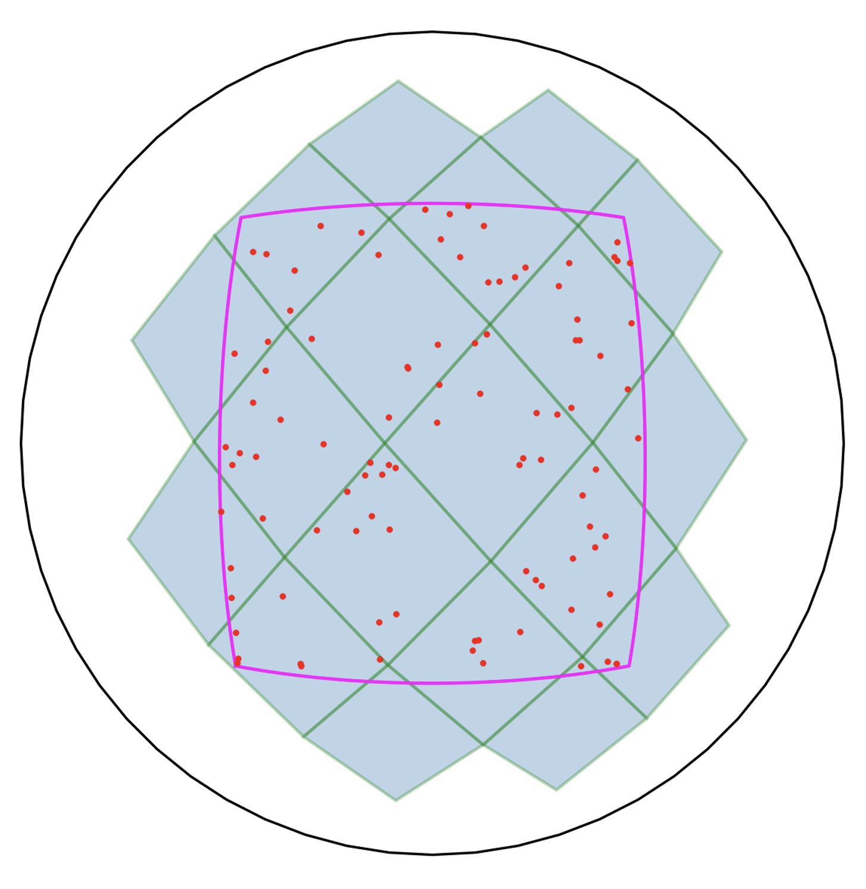

# Welcome to the STARQUERY package

[](https://pypi.python.org/pypi/starcatalogquery/) [](https://pypi.python.org/pypi/starcatalogquery/) [](https://pypi.python.org/pypi/starcatalogquery/) [](https://GitHub.com/lcx366/STARQUERY/graphs/contributors/) [](https://GitHub.com/lcx366/STARQUERY/graphs/commit-activity) [](https://github.com/lcx366/STARQUERY/blob/master/LICENSE) [](http://starcatalogquery.readthedocs.io/?badge=latest) [](https://travis-ci.org/lcx366/starcatalogquery)

This package is an archive of scientific routines for establishing an offline star catalog query database. Currently, operations on star catalogue query include:

1. From the remote server ([MIKULSKI ARCHIVE&
   SPACE TELESCOPES](https://archive.stsci.edu)) to obtain star catalog data, and build an offline star catalog database locally;
2. Simplify the original star catalogs to reduce the storage volume of star catalogs;
3. Filter out the required stars according to the selected sky area, including rectangle search and spherical cap(cone) search;
4. Given a pixel width, calculate the pixel coordinates of the filtered stars;
5. Visualize the scope of the search area and the coverage of the corresponding catalog tiles.
6. According to the HEALPix algorithm, the celestial sphere is divided into multiple sky areas, and a feature library is established in each sky area for blind matching of star maps.
7. Load the local offline star catalog database;

## How to Install

On Linux, macOS and Windows architectures, the binary wheels can be installed using pip by executing one of the following commands:

```
pip install starcatalogquery
pip install starcatalogquery --upgrade # to upgrade a pre-existing installation
```

## How to use

### Build an offline star catalog database

Get the star catalog data from the remote server ([MIKULSKI ARCHIVE&
SPACE TELESCOPES](https://archive.stsci.edu)) , and build an offline star catalog database locally. Currently, available star catalogs include 'hygv35', 'gsc12', 'gsc242', 'gaiadr3', '2mass', 'ucac5', 'usnob', etc.

```python
>>> from starcatalogquery import StarCatalog
>>> # Get the star catalog GAIADR3 with the tile size of 2 deg
>>> gaiadr3_raw = StarCatalog.get('gaiadr3',2)
```

We get an instance of class StarCatalogRaw with

    Attributes:
        - tiles_path: Path of the starcatalog tile files. 
        - sc_size: The size of the star catalog.
        - tiles_num: Total number of the tile files.
        - validity: The validity of the star catalog.
        - sc_name: Name of the starcatalog. Available starcatalogs include 'hygv35', 'gsc12', 'gsc242', 'gaiadr3', '2mass', 'ucac5', 'usnob', etc.
        - tile_size: Size of the tile in [deg]
        - _mode: Types of star catalogs, including 'raw', 'reduced', 'simplified', where
            'raw' represents the original star catalog, which contains all information about the star
            'reduced' represents the reduced star catalog, which contains the position, proper motion, apparent magnitude, epoch of the star
            'simplified' represents the minimalist star catalog, which only includes the position and apparent magnitude of stars
        - stars_num: Total number of stars in the catalog
        - mag: Apparent magnitude of stars in the catalog
        - description: Catalog Summary
    Methods:
        - load: Load the raw star catalog files from the local database.
        - reduce: Reduce the original star catalog so that the reduced star catalog only contains necessary information such as the position, proper motion, apparent magnitude, epoch, etc.
        - search_box: Perform a rectangle search of stars on the raw star catalog and return an instance of class Stars.
        - search_cone: Perform a cone search of stars on the raw star catalog and return an instance of class Stars.   
        - _search_draw: Visualize the scope of the search area and the coverage of the corresponding tiles.  

### Reduce the raw star catalogs

The original star catalog contains all the catalog information of the stars, which takes up a huge storage space and slows down the speed of star query. Therefore, we need to extract the necessary information of stars from it, and use the method `.reduce()` to build a reduced star catalog database.

```python
>>> gaiadr3_reduced = gaiadr3_raw.reduce()
```

The reduced star catalog only contains the celestial position, proper motion, apparent magnitude, and epoch of stars.

### Simplify the reduced star catalogs

In order to further reduce the size of the star catalog and improve its query efficiency, we filter out the reduced star catalog according to the limit magnitude of the detector, and make proper motion corrections to obtain a minimalist star catalog.

```python
>>> gaiadr3_simplified = gaiadr3_reduced.simplify()
```

The simplified(minimalist) star catalog only includes the celetial position and apparent magnitude of stars at a specific epoch.

### Query information about stars in a specific sky area

Perform a cone search of stars on the raw or reduced star catalog.

```python
>>> # Set center pointing in format of [Ra,Dec] in [deg] and search radius in [deg]
>>> center,radius = [20,30],15 
>>> # Set cutoff magnitude and observation epoch
>>> mag_threshold,t_pm = 8.0,2023.5
>>> # Set the maximum number of brightest stars to output
>>> max_control_points = 100 # optinal, default = None
>>> gaiadr3_raw_stars = gaiadr3_raw.search_cone(center,radius,mag_threshold,t_pm,max_control_points)
>>> gaiadr3_reduced_stars = gaiadr3_reduced.search_cone(center,radius,mag_threshold,t_pm,max_control_points)
```

Perform a rectangle search of stars on the raw or reduced star catalog.

```python
>>> # Set a rectangular search area in format of [ra_min,dec_min,ra_max,dec_max] in [deg]
>>> radec_box = [5,15,35,45]
>>> # Set cutoff magnitude and observation epoch
>>> mag_threshold,t_pm = 8.0,2023.5
>>> # Set the maximum number of brightest stars to output
>>> max_control_points = 100 # optinal, default = None
>>> gaiadr3_raw_stars = gaiadr3_raw.search_box(radec_box,mag_threshold,t_pm,max_control_points)
>>> gaiadr3_reduced_stars = gaiadr3_reduced.search_box(radec_box,mag_threshold,t_pm,max_control_points)
```

Perform a cone/rectangle search of stars on the simplified star catalog.

```python
>>> gaiadr3_simplified_stars = gaiadr3_simplified.search_cone(center,radius,max_control_points)
>>> gaiadr3_simplified_stars = gaiadr3_simplified.search_box(radec_box,max_control_points)
```

We get an instance of class Stars, with

    Attributes:
        - sc_name: Name of the starcatalog.
        - center: Center pointing in format of [ra_c,dec_c] in [deg]
        - df: Dataframe of the stars
        - max_control_points: Number of stars in the dataframe
        - radec: Celestial coordinates of stars
    Methods:
        - pixel_xy: Calculate the pixel coordinates of stars in a sky area.

### Calculate the pixel coordinates of the filtered stars

Given the pixel width of the detector, calculate the pixel coordinates of the filtered stars using the *TAN* projection in WCS transformations.

```python
>>> pixel_width = 0.01 # pixel width in [deg]
>>> gaiadr3_simplified_stars.pixel_xy(0.01)
>>> print(gaiadr3_simplified_stars.xy)
```

### Calculate the triangle invariants and the asterism indices of the filtered stars

```python
>>> gaiadr3_simplified_stars.invariantfeatures()
>>> print(gaiadr3_simplified_stars.invariants,gaiadr3_simplified_stars.asterisms,.kdtree)
```

### Visualization

Visualize the scope of the search area and the coverage of the corresponding catalog tiles.

```python
>>> box_area = {'box':[5,15,35,45]} # {'box':[ra_min,dec_min,ra_max,dec_max]}
>>> cone_area = {'cone':[20,30,15]} # {'cone':[ra_c,dec_c,radius]}
>>> gaiadr3_simplified._search_draw(box_area)
>>> gaiadr3_simplified._search_draw(cone_area)
>>> # ._search_draw is also available for gaiadr3_raw and gaiadr3_reduced
```

<p align="middle">
  
</p>

<p align="middle">
  
</p>

### Divide the sky

The celestial sphere can be divided into multiple equal-area sky regions using the HEALPix algorithm. Then a feature library is established in each sky area for blind matching of star maps. 

<p align="middle">
  
</p>

<p align="middle">
  
</p>

By default, we adopt the following strategy to divide the sky area:

- For FOV > 43, k = 0, radius of cone search = 34; 

- For FOV > 22, k = 1, radius of cone search = 17;

- Else, k = 2, radius of cone search = 9

```python
>>> fov,pixel_width = 20,0.01 # in [deg]
>>> # Set the maximum number of brightest stars in earch sky area
>>> max_control_points = 40 # optional, default = 60
>>> outh5 = gaiadr3_simplified.h5_incices(fov,pixel_width,max_control_points)
```

A h5-formatted star catalog file `outh5`is generated, which records the center pointing of each sky area, the pixel coordinates, the triangle invariants and the asterism indices of the stars.

### Read in h5-formatted star catalog file

```python
>>> from starcatalogquery import StarCatalog
>>> infile_h5 = 'starcatalogs/indices/hygv35/fov20_mag8_mcp40_2023.0.h5'
>>> fp_radecs,stars_xy,stars_invariants,stars_asterisms = StarCatalog.read_h5_indices(infile_h5)
```

### Load the local offline star catalog database

#### Load the raw or reduced star catalog

```python
>>> from starcatalogquery import StarCatalog
>>> dir_from_raw = '/Volumes/TOSHIBA/starcatalogs/raw/hygv35/res2/' # Path of the raw starcatalog
>>> hygv35_raw = StarCatalog.load(dir_from_raw)
>>> # dir_from_reduced = '/Volumes/TOSHIBA/starcatalogs/reduced/hygv35/res2/' # Path of the reduced starcatalog
>>> # hygv35_reduced = StarCatalog.load(dir_from_reduced)
```

#### Load the simplified star catalog

```python
>>> from starcatalogquery import StarCatalog
>>> dir_from_simplified = '/Volumes/TOSHIBA/starcatalogs/raw/hygv35/res5/mag8.0/epoch2023.0/' # Path of the starcatalog
>>> hygv35_raw = StarCatalog.load(dir_from_simplified)
```

## Change log

- **0.1.7 — Jun 16, 2023**
  
  - Simplified parameter input of `StarCatalog.load` for star catalog loading.

- **0.1.5 — May 13, 2023**
  
  - Add method `.invariantfeatures()` to class `Stars`, which calculates the triangle invariants and constructs a 2D Tree; and records the asterism indices for each triangle.

- **0.1.0 — May 10,  2023**
  
  - The ***starcatalogquery*** package was released.

## Reference

- [MIKULSKI ARCHIVE&SPACE TELESCOPES](https://archive.stsci.edu)
- [Astroalign](https://astroalign.quatrope.org/en/latest/index.html)
- [HEALPix](https://healpix.sourceforge.io)
