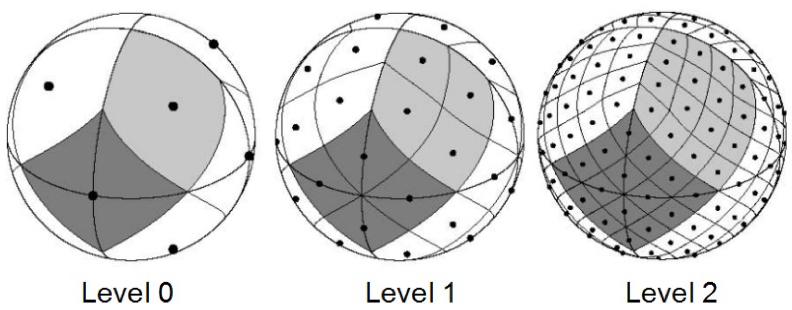

# Welcome to the STARQUERY package

[](https://pypi.python.org/pypi/starcatalogquery/) [](https://pypi.python.org/pypi/starcatalogquery/) [](https://pypi.python.org/pypi/starcatalogquery/) [](https://GitHub.com/lcx366/STARQUERY/graphs/contributors/) [](https://GitHub.com/lcx366/STARQUERY/graphs/commit-activity) [](https://github.com/lcx366/STARQUERY/blob/master/LICENSE) [](http://starcatalogquery.readthedocs.io/?badge=latest) [](https://travis-ci.org/lcx366/starcatalogquery)

**STARQUERY** is a high-performance Python package for offline star catalog querying. It provides fast, local access to partitioned star catalogs and supports filtering, tile-level querying, and pixel coordinate calculation, etc.

Version **2.x** introduces significant architectural improvements:

- Star catalogs are partitioned at the **HEALPix K5 level (nside=32)** using the **nested ordering scheme** (previously ring-ordered in v1.x).
- Each catalog tile is now stored as a **compressed binary Parquet file**, replacing the plain-text CSV format used in v1.x.
- The bulky static index database from v1.x has been **entirely removed**. Index files are now generated on-demand in binary format, significantly reducing disk space usage.
- Query performance has improved by **up to 50%**, especially for large-FOV queries.

## 🚀 Key Features

1. **Offline Star Catalog Database Creation**
   
   - Easily import star catalog data from popular astronomical sources such as the [STScI Outerspace](https://outerspace.stsci.edu/display/MASTDATA/Catalog+Access) and [The Astronomy Nexus](https://www.astronexus.com/hyg).
   
   - Build a local star catalog database for offline usage, eliminating the need for  online queries.

2. **Data Simplification**
   
   - Extract essential star attributes (like position, magnitude, etc.) from massive star catalog files to streamline data storage and access, speeding up the query process.

3. **Star Query**
   
   - **Rectangle Query**: Search for stars within a defined rectangular area on the sky.
   
   - **Spherical Cap (Cone) Query**: Search for stars within a specific angular distance from a given point.

4. **Visualization**
   
   - Visualize the search area and catalog tiles, helping users verify that the search area is properly covered by the catalog tiles.

5. **Pixel Coordinate Calculation**
   
   - Convert celestial coordinates (RA, Dec) to pixel coordinates with a specified pixel width, useful for aligning star charts with sensor data, such as from telescopes or cameras.

6. **Invariant Features Computation**
   
   - Calculate geometrically invariant features(triangles and quads) based on the spatial configuration of stars.

7. **HEALPix-based Sky Area Division**
   
   - Utilize the HEALPix algorithm to divide the celestial sphere into equal-area tiles, enabling efficient data partitioning and indexing.

8. **Astronomical Corrections**
   
   - Enhances the accuracy of star positions by applying
     
     - **Proper Motion**: Adjust star positions based on their velocity across the sky.
     
     - **Aberration**: Correct for the apparent shift in star positions due to Observer’s motion.
     
     - **Parallax**: Adjust for the apparent positional shift due to Earth’s orbit around the Sun.
     
     - **Deflection**: Correct for the bending of light caused by gravitational fields of the Sun.

## 🛠️ How to Install

To install STARQUERY, simply use `pip` in your terminal:

```
pip install starcatalogquery
pip install starcatalogquery --upgrade # to upgrade a pre-existing installation
```

If an error message similar to "`ERROR: Could not build wheels for cartopy, which is required to install pyproject.toml-based projects`" is displayed, a good solution is

```bash
mamba install h5py
mamba install cartopy 
```

## **📚** How to Use

Below are some basic examples to help you get started with STARQUERY.

### Build an Offline Star Catalog Database

To start building your database, for example, just download the AT-HYG v3.2 star catalog.

```python
>>> from starcatalogquery import StarCatalog
>>> sc_raw = StarCatalog.get('at-hyg32') # Get the raw star catalog AT-HYG v3.2
>>> print(sc_raw)
```

```python
<StarCatalogRaw object: CATALOG_NAME = 'at-hyg32' CATALOG_SIZE = '464.2 MB' TILES_NUM = 12288 TILE_SIZE = '1.83 deg' STARS_NUM = '2552164' MAG = '< 12'>
```

The `StarCatalog.get()` method fetches the star catalog (**at-hyg32** in this example) from online sources, mainly [STScI Outerspace](https://outerspace.stsci.edu/display/GC/WebServices+for+Catalog+Access) and [The Astronomy Nexus](https://www.astronexus.com/hyg). By default, the downloaded catalog is saved to `starcatalogs/raw/at-hyg32/` under the path  **~/src/sc-data/**. The catalog is divided into **K5-level** tiles, following the HEALPix **NEST** hierarchical structure. 

<p align="middle">
  
</p>

<p align="middle">
 
</p>

STARQUERY supports a wide range of star catalogs, which are listed below with their corresponding identifiers:

| Star Catalog Name     | Identifier |
|:---------------------:|:----------:|
| HYG v4.1              | hyg41      |
| AT-HYG v3.2           | at-hyg32   |
| GAIA DR3              | gaiadr3    |
| Guide Star Catalog 30 | gsc30      |
| UCAC5                 | ucac5      |
| USNO-B1.0             | usnob      |
| 2MASS                 | 2mass      |

### Simplify the Raw Star Catalog

The raw star catalog typically contains extensive information about stars, resulting in large file sizes that can slow down query performance. To optimize this,  a more compact version can be created by extracting only the essential information.

```python
>>> sc_reduced = sc_raw.reduce()
>>> print(sc_reduced)
```

```python
<StarCatalogReduced object: CATALOG_NAME = 'at-hyg32' CATALOG_SIZE = '149.6 MB' TILES_NUM = 12288 TILE_SIZE = '1.83 deg' STARS_NUM = '2552164' MAG = '< 12'>
```

The reduced star catalog includes only essential star attributes as follows: 

- **Celestial Position** (RA, Dec) in degrees

- **Proper Motion** in milliarcseconds per year

- **Apparent Magnitude**

- **Distance** in kiloparsecs

- **Epoch**

### Filter the Reduced Star Catalogs

To further improve query efficiency, the reduced star catalog can be filtered based on the sensor’s FOV or self-defined magnitude cutoff. Additionally, proper motion corrections are applied to adjust star positions to bring them closer to the specified observation time.

```python
>>> fov = [2.0,2.0] # Set the FOV of camera as [fov_H,fov_V]
>>> t_pm = 2019.5 # Set the observation time for proper motion correction
>>> sc_simplified = sc_reduced.simplify(t_pm,fov=fov)
>>> print(sc_simplified) 
```

```python
<StarCatalogSimplified object: CATALOG_NAME = 'at-hyg32' CATALOG_SIZE = '137.1 MB' TILES_NUM = 12288 TILE_SIZE = '1.83 deg' STARS_NUM = '1959581' MAG = '< 12' MAG_CUTOFF = 12.0 EPOCH = 2019.5>
```

The Catalog Simplification Workflow is as follows:

1. **Applying magnitude cutoff and proper motion correction**
   
   - Remove stars fainter than the specified magnitude cutoff and update coordinates to a consistent observation epoch

2. **Redistributing stars into correct tile files**
   
   - **Initial misclassification** — Catalogs sourced from services like [STScI Outerspace](https://outerspace.stsci.edu/display/GC/WebServices+for+Catalog+Access) may contain stars incorrectly assigned to HEALPix tiles, especially near tile boundaries, due to spherical polygon inaccuracies.
   
   - **Proper motion drift** — After applying proper motion corrections to shift stars to a common epoch, some stars may cross tile boundaries and must be reassigned to their new correct HEALPix regions.

3. **Sorting by magnitude**
   
   - Stars within each tile are sorted from **brightest to faintest**, enabling fast magnitude-based filtering and search.

4. **Converting CSV to Parquet**
   
   - All tile files are converted to **compressed binary Parquet format**, reducing disk space and improving read performance.

To determine an appropriate **HEALPix level** for a given field of view (FOV), the coarsest HEALPix resolution is selected such that each tile is smaller than half of the FOV, ensuring meaningful spatial partitioning within the region of interest. Once a HEALPix level is selected, the corresponding **magnitude cutoff** can be estimated such that it guarantees that each HEALPix tile contains at least a threshold number of stars (on average, default=30), based on a logarithmic empirical model of stellar counts:

$$
N_s(m) \sim 10^{(\alpha  m + \beta)}
$$

Conversely, if the **catalog magnitude cutoff** is known, the **maximum HEALPix resolution** that maintains the desired per-pixel star density can be computed.

```python
>>> mag_threshold = 12.0
>>> sc_simplified = sc_reduced.simplify(t_pm,mag_threshold=mag_threshold)
>>> print(sc_simplified)
```

### Load the Local Offline Star Catalog Database

Here’s how to load the raw, reduced, and simplified star catalogs:

```python
>>> from starcatalogquery import StarCatalog
>>> import os

>>> base_dir = os.path.expanduser("~/src/sc-data")
>>> # Load the raw star catalog
>>> dir_from_raw = os.path.join(base_dir,'starcatalogs/raw/at-hyg32/')  # Path to the raw star catalog
>>> sc_raw = StarCatalog.load(dir_from_raw)
>>> print(sc_raw)

>>> # Load the reduced star catalog
>>> dir_from_reduced = os.path.join(base_dir,'starcatalogs/reduced/at-hyg32/')  # Path to the reduced star catalog
>>> sc_reduced = StarCatalog.load(dir_from_reduced)
>>> print(sc_reduced)

>>> # Load the simplified star catalog
>>> dir_from_simplified = os.path.join(base_dir,'starcatalogs/simplified/at-hyg32/lvl6-mag12.0/epoch2019.5/')  # Path to the simplified star catalog
>>> sc_simplified = StarCatalog.load(dir_from_simplified)
>>> print(sc_simplified)
```

### Query Stars over a Specific Sky Area

Both **conical** (circular) and **rectangular** region-based queries on the **simplified, HEALPix-partitioned star catalogs** are supported. To ensure fast search operations, an **index database** is required. However, this index is:

- **Automatically built** during the catalog simplification phase, or

- **Automatically generated** upon first loading the simplified catalog (on-demand), if not already present.

Users may also choose to **manually trigger index generation**,

```python
>>> sc_simplified.build_indices()
```

Indices are computed **per tile** and aggregated into a global index table, which is **hierarchically ordered by HEALPix level** to support efficient multi-resolution sky searches. By default, the index table is stored under the directory `~/src/sc-data/starcatalogs/indices/`as a **compressed binary Parquet file**, which is consistent with the catalog tile format.

#### 🔍 Perform a Star Catalog Query

##### Conical Star Query

```python
from starcatalogquery import StarCatalog

# Set search parameters
center = [20, 30]  # Center point [RA, Dec] in degrees
radius = 1.5  # Search radius in degrees
max_num = 100  # Optional: Maximum number of stars to return

# Perform a conical search
sc_simplified_stars = sc_simplified.search_cone(center, radius, max_num=max_num)
print(sc_simplified_stars)
```

```python
<Stars object: CATALOG = 'at-hyg32' STARS_NUM = 245 MCP = 100>
```

When performing a star catalog query, especially over a large area, it’s possible that the brightest stars might cluster within the search area. To address this, STARQUERY allows to **limit the number of stars extracted per HEALPix tile**. This ensures a more even distribution of bright stars across the entire search region.

```python
max_num_per_tile = 5
sc_simplified_stars = sc_simplified.search_cone(center, radius, max_num_per_tile=max_num_per_tile)
print(sc_simplified_stars)
```

```python
<Stars object: CATALOG = 'at-hyg32' STARS_NUM = 45 MCP = 45>
```

If the HEALPix level is not explicitly specified—either through a predefined level or an associated field of view (FOV)—the query system **automatically selects an appropriate hierarchical level** based on the angular size of the search area. This adaptive mechanism ensures an optimal balance between query resolution and performance, especially for sky regions of varying scales.

```python
>>> dir_from_simplified = os.path.join(base_dir,'starcatalogs/simplified/at-hyg32/lvl996-mag12.0/epoch2019.5/')  # Path to the simplified star catalog
>>> sc_simplified = StarCatalog.load(dir_from_simplified)
>>> sc_simplified_stars = sc_simplified.search_cone(center,radius)
>>> print(sc_simplified_stars)
```

```python
<Stars object: CATALOG = 'at-hyg32' STARS_NUM = 245 MCP = 245>
```

##### Rectangular Star Query

```python
>>> radec_box = [18.5, 28.5, 21.5, 31.5]  # [ra_min, dec_min, ra_max, dec_max] in degrees
>>> max_num = 100  # Optional: Maximum number of stars to return
>>> # Rectangle search on the simplified catalog (no magnitude limit needed)
>>> sc_simplified_stars = sc_simplified.search_box(radec_box, max_num=max_num)
>>> print(sc_simplified_stars)
```

```python
<Stars object: CATALOG = 'at-hyg32' STARS_NUM = 282 MCP = 100>
```

##### Astronomical Corrections

During star queries, a set of optional **astrometric corrections** can be applied to improve positional accuracy. The following corrections are supported:

- **proper-motion** – Accounts for the intrinsic motion of stars over time due to their velocities relative to the solar system barycenter.

- **aberration** – Corrects for the apparent displacement of star positions caused by the motion of the observer (e.g., Earth’s orbital velocity).

- **parallax** – Corrects for the apparent shift in star positions due to the observer’s change in position as the Earth moves around the Sun.

- **deflection** – Applies general relativistic corrections for the bending of starlight by the gravitational field of the Sun (light deflection), especially significant when stars are near the solar limb.

```python
>>> # Define astrometry corrections
>>> astrometry_corrections = {
    't': '2019-02-26T20:11:14.347',  # Observation time (UTC)
    'proper-motion': None,  # Apply proper motion correction
    'aberration': (0.5595, -1.1778, 7.5032),  # Observer's velocity (vx, vy, vz) in km/s
    'parallax': None,  # Apply parallax correction
    'deflection': None  # Apply light deflection correction
>>> }
>>> # Perform a conical query with astronomical corrections
>>> sc_simplified_stars = sc_simplified.search_cone(center, radius, astrometry_corrections=astrometry_corrections)
```

### Calculate the Pixel Coordinates

After filtering the stars, their celestial coordinates (Right Ascension and Declination) can be projected onto a two-dimensional image plane using the **TANGENT (TAN) projection**, a standard method within the World Coordinate System (WCS) framework.

```python
>>> pixel_width = 0.001 # Set the pixel width in degrees
>>> # Calculate the pixel coordinates using the TAN projection
>>> sc_simplified_stars.pixel_xy(pixel_width)
>>> # Retrieve the calculated pixel coordinates
>>> xy = sc_simplified_stars.xy
>>> print(xy)
```

### Calculate the Geometric Invariants

To support **star pattern recognition**, tools to compute **geometric invariants** for asterisms (star groups) are provided, specifically triangles and quads. These invariants serve as **rotation- and scale-invariant descriptors**, suitable for fast lookup using k-d tree structures.

**1. Triangle Invariants**

*This approach is inspired by the* [*Astroalign*](https://astroalign.quatrope.org/en/latest/) *package (Beroiz et al.).* For all possible triangles formed by nearest-neighbor star triplets:

1. **Derive Geometric Invariants**
   
   - For each triangle, compute the side lengths and define geometric invariants as ratios $\left(\frac{L_2}{L_1},\frac{L_1}{L_0}\right)$, where,  $L_2$, $L_1$, $L_0$ are the sides of the triangle sorted in descending order.

2. **Construct a 2D-Tree Structure**
   
   - Use these invariants to build a 2D-Tree structure.

3. **Link to Asterisms**
   
   - Associate each invariant vector with the corresponding star indices that define the triangle.

**2. Quad Invariants**

*This method follows the approach used by* [*Astrometry.net*](https://astrometry.net)*.* For all possible star quads (sets of 4 stars):

1. **Derive Geometric Invariants**
   
   - Select the most distant star pair as reference points (A and B) and define a local coordinate system using this pair.
   
   - Express the other two stars (C, D) in normalized coordinates and build a invariant vector:  ($x_C, y_C, x_D, y_D$) .

2. **Break Symmetries**
   
   - Enforce constraints  $x_C \leq x_D$ and  $x_C + x_D \leq 1$ to eliminate redundant permutations.

3. **Construct a 4D-Tree Structure**
   
   - Utilize the invariants to build a 4D-Tree structure.

4. **Link to Asterisms**
   
   - Associate each invariant vector with the corresponding star indices that define the quad.

```python
>>> # Choose the mode of geometric invariants to calculate: 'triangles' or 'quads'
>>> mode_invariants = 'triangles'

>>> # Calculate the geometric invariants
>>> sc_simplified_stars.invariantfeatures(mode_invariants)

>>> # Retrieve the generated invariants, asterisms, and 2D/4D-Tree structure
>>> invariants = sc_simplified_stars.invariants
>>> asterisms = sc_simplified_stars.asterisms
>>> kdtree = sc_simplified_stars.kdtree
```

### Visualization

STARQUERY supports visualization of both **conical** and **rectangular** sky regions, and can highlight all **HEALPix tiles** that intersect with the specified search area. This feature helps users visually verify tile coverage, understand spatial indexing behavior, and debug query boundaries.

```python
>>> # Visualize the coverage of the box search area
>>> sc_simplified_stars.tiles_draw()
```

<p align="middle">
  
</p>

```python
>>> # Visualize the coverage of the cone search area
>>> sc_simplified_stars.tiles_draw()
```

<p align="middle">
  
</p>

## 🔧 Change log

- **2.0.0 — May 03, 2025**
  
  - Changed HEALPix tile ordering from **RING** to **NESTED**.
  
  - Removed query support for both **raw** and **reduced** star catalogs; only **simplified** catalogs are now queryable.
  
  - Switched tile storage format from **CSV** to compressed **Parquet**, significantly reducing disk usage and improving I/O speed.
  
  - Replaced the SQL-based indices database with lightweight **Parquet-based indices**.
  
  - Enabled **parallel construction** of geometric hash files to accelerate small-scale hash generation.

- **1.1.5 — Nov 18, 2024**
  
  - Fixed the problem caused by the rectangle near the celestial pole degenerating into a triangle in the spherical rectangle query.
  
  - Polished the usage documentation.

- **1.1.4 — Oct 30, 2024**
  
  - Set the maximum display records for DataFrames to 200 by default.

- **1.1.3 — Oct 14, 2024**
  
  - Fixed an error in parallel processing when applying astronomical corrections (primarily caused by JPL ephemeris memory mapping).

- **1.1.2 — Sep 29, 2024**
  
  - Normalize RA to [0, 360) when converting cartesian coordinates to spherical coordinates.

- **1.1.1 — Sep 04, 2024**
  
  - The number of nearest neighbor stars for constructing geometric invariants has been increased to *nine*.
  - Added functions `vectorized_unique_quads` and `vectorized_unique_triangles` for vectorizing the calculation of geometric invariants.
  - The pixel scale used for conversion between pixel coordinates and astronomical coordinates via WCS (World Coordinate System) transformations has been refined from *0.01 degrees/pixel* to *0.001 degrees/pixel*.
  - The number of stars extracted per tile at all levels has been reduced to *five* during the generation of hash files for geometric invariants.
  - Adjusted the calculation for determining healpix level based on field of view size.
  - A new class, `H5HashesData`, has been introduced.

- **1.0.5 — Aug 08, 2024**
  
  - Fixed the memory overflow issue caused by processing giant star catalog tile files.

- **1.0.3 — Jul 27, 2024**
  
  - Raise the healpix level of the star catalog tiles from K4 to K5 to avoid the trouble of downloading large files from remote servers that are prone to failure.

- **1.0.2 — Jul 17, 2024**
  
  - In checking the validity of star catalog files, use the `wc -l` command with the subprocess module to quickly count the number of lines in the CSV file, which is more efficient than a pure Python implementation.
  - Fixed a bug in the validity check of star catalog files

- **1.0.1 — Jul 16, 2024**
  
  - Added parameters that limit the magnitude range to avoid the problem of remote server data overflow and download failure.

- **1.0.0 — Jul 04, 2024**
  
  - Replaced the spherical rectangular partitioning with a multi-level equal-area partitioning strategy based on the HEALPix algorithm.
  - Established a star catalog index database system that adaptively selects the appropriate level based on the size of the search area or FOV.
  - Added functionality to generate geometrically invariant features using four stars and create hash tables.
  - Enhanced star position corrections with proper motion, annual parallax, aberration, and light deflection adjustments.
  - Added visualization capabilities for multi-level equal-area sky region partitioning.

- **0.1.14 — Nov 29, 2023**
  
  - Minor bugs fixed.

- **0.1.13 — Nov 26, 2023**
  
  - Added the capability to download, load, and simplify the *AT-HYGv2.4* star catalog.
  - Implemented a Rotation angle (in radians) in the `pixel_xy` method to align the WCS frame (equivalent to ENU) with the image reference frame.
  - Enhanced the `__repr__` method to provide a formatted summary of the instance.

- **0.1.12 — Sep 23, 2023**
  
  - Minor bugs fixed.

- **0.1.11 — Sep 04, 2023**
  
  - Adjusted parameters for dividing the celestial sphere into multiple equal-area sky regions using the HEALPix algorithm and the corresponding radius of cone search for blind matching of star maps.
  - Reorganized the equal-area sky regions to gradually transition from the celestial equator to the poles.
  - Minor bugs fixed.

- **0.1.10 — Jul 23, 2023**
  
  - Introduced the HEALPix algorithm for dividing the celestial sphere into multiple equal-area sky regions.

- **0.1.8 — Jul 03, 2023**
  
  - Removed dependency on **pyshtools**
    
    - Added function `from_cap` to replace `pysh.SHGrid.from_cap` in *catalog_query.py*
    
    - Using `SphericalCircle` in *astropy* to replace `MakeCircleCoord` in *pyshtools.utils* 
    
    - Added function `from_cap` in *catalog_query.py* to replace `pysh.SHGrid.from_cap`.
    
    - Replaced `MakeCircleCoord` in *pyshtools.utils* with `SphericalCircle` from *Astropy*.

- **0.1.7 — Jun 16, 2023**
  
  - Simplified parameter input for `StarCatalog.load` to facilitate star catalog loading.

- **0.1.5 — May 13, 2023**
  
  - Added the `.invariantfeatures()` method to the `Stars` class, which calculates triangle invariants, constructs a 2D-Tree, and records asterism indices for each triangle.

- **0.1.0 — May 10,  2023**
  
  - Release of the ***starcatalogquery*** package.

# 📄 Reference

The development of STARQUERY has been influenced and supported by a variety of external resources and tools. Below are some of the key references:

- [**STScI Outerspace**](https://outerspace.stsci.edu/display/GC/WebServices+for+Catalog+Access): The Space Telescope Science Institute provides web services for catalog access, which have been instrumental in the development of STARQUERY.
- [**The Astronomy Nexus**](https://www.astronexus.com/hyg): A valuable resource providing comprehensive star catalog data, such as  the HYG and AT-HYG database. STARQUERY utilizes this resource for accessing detailed astronomical data.
- [**Astroalign**](https://astroalign.quatrope.org/en/latest/index.html): This Python package by Beroiz, M. I. is a significant reference, especially in the development of star pattern recognition features within STARQUERY.
- [**HEALPix**](https://healpix.sourceforge.io): The Hierarchical Equal Area isoLatitude Pixelization (HEALPix) tool has been a reference for implementing the division of the celestial sphere into equal-area sky regions. Learn more about HEALPix at their website.
